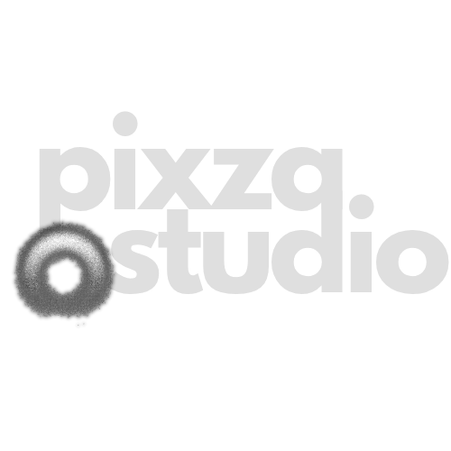

<div align="center">



# Pixza Studio
### An Open Visual Workflow Editor for AI Creative Pipelines

Build AI image, 3D, audio and video generation pipelines by connecting nodes on a visual canvas.
Powered by WordPress Auth and optimized for VPS deployment.

[**Master Setup Guide**](./MASTER_SETUP_GUIDE.md) &nbsp;&bull;&nbsp; [WhatsApp Support](https://wa.me/...)

<br />

</div>

## 🎨 Creative Agents for Prolific Output

Pixza Studio is a node-based workflow editor for AI media generation. Drag nodes onto an infinite canvas, connect them with typed handles, and execute pipelines that transform and generate media across multiple providers.

- **Dynamic Prompting**: Build adaptive prompts with variables and LLM constructors.
- **Multi-Modal**: Generate images (FLUX, Gemini), Video (Kling, Veo), Audio, and 3D in one flow.
- **WordPress Integrated**: Seamless authentication and subscription management via WordPress.
- **Self-Hosted**: Deploy to your own VPS with Coolify and local storage.

## 🚀 Quick Start (Local Development)

1. **Clone & Install**:
   ```bash
   git clone https://github.com/gusfing/pixza_ai.git
   cd pixza_ai
   npm install
   ```

2. **Environment**:
   Copy `.env.example` to `.env` and fill in:
   - `DATABASE_URL` (Neon PostgreSQL)
   - `NEXT_PUBLIC_WP_URL` (Your WP Site)
   - `WP_API_SECRET` (From WP Plugin)
   - `GEMINI_API_KEY` (From Google AI Studio)

3. **Run**:
   ```bash
   npm run dev
   ```

## ☁️ Production Deployment

We recommend **Coolify** on a Hostinger/Ubuntu VPS using the **Dockerfile** build pack.

See the [**Master Setup Guide**](./MASTER_SETUP_GUIDE.md) for full instructions on:
- WordPress Plugin setup.
- Coolify Environment Configuration.
- Persistent Storage & S3.
- Admin Promotion.

## 🛠️ Tech Stack

- **Frontend**: Next.js 16 (App Router), React 19, TailwindCSS, Zustand.
- **Backend**: Node.js, Prisma ORM, PostgreSQL.
- **Visuals**: xyflow (React Flow), Three.js (3D Viewer).
- **Auth**: WordPress JWT REST API integration.

## 📄 License

MIT © 2025 Pixza Studio
